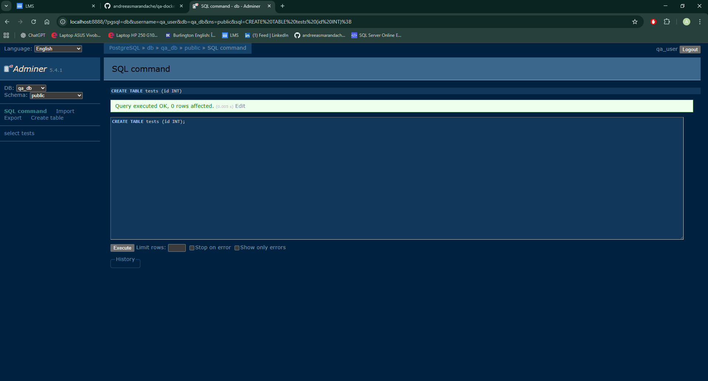

# REZOLVARE - Docker Compose QA Lab

## Screenshot

## Explicatie flag -v
Comanda docker compose down opreste si sterge containerele. Daca adaugam si flagul -v atunci va sterge si volumele de date.  
Este necesar sa il adaugam pentru ca, doar asa, se reseteaza complet mediul si baza de date. 
Totul este sters si recreat de la zero la urmatoarea pornire.
